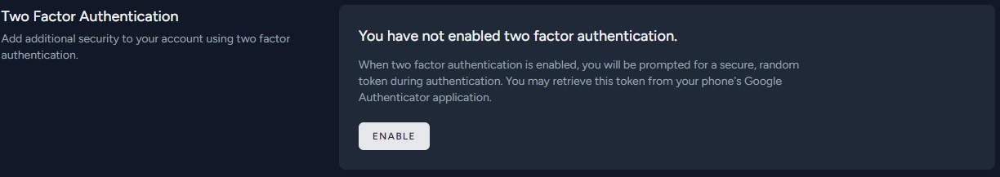

# 2FA - Two Factor Authentication

- [Introduction](#introduction)

## Introduction

2FA is implemented to better protect both a user's credentials and the resources the user can access. Two factor authentication provides a higher level of security than authentication methods that depend on single-factor authentication (SFA), in which the user provides only one factor -- typically, a password or passcode. Two factor authentication methods rely on a user providing a password as the first factor and a second, different factor -- usually either a security token or a biometric factor, such as a fingerprint or facial scan.

Two factor authentication adds an additional layer of security to the authentication process by making it harder for attackers to gain access to a person's devices or online accounts because, even if the victim's password is hacked, a password alone is not enough to pass the authentication check.

Two factor authentication (2FA) option can be enabled by user from Profile Edit page.

